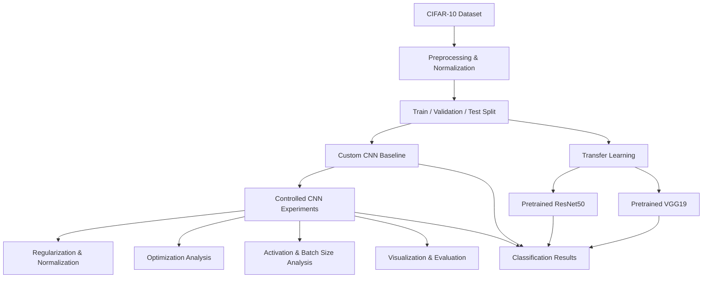
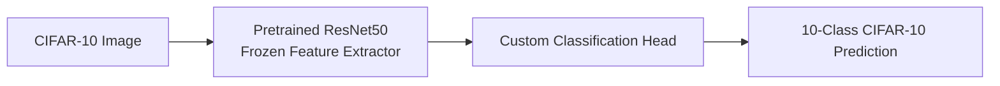
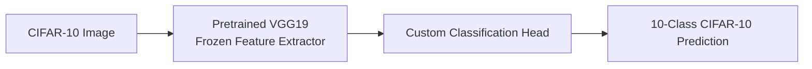

<div align="center">


</div>

---

# Image Classification with CNNs on CIFAR-10: Architecture, Optimization, and Transfer Learning

This project presents a systematic deep learning study of image classification on the CIFAR-10 dataset using PyTorch. It investigates how convolutional neural network design choices, regularization strategies, optimization settings, activation functions, batch size, and transfer learning affect classification performance.

The project progresses from a custom CNN baseline to controlled architectural and training experiments, followed by feature-map and prediction visualization, confusion-matrix analysis, optimizer comparison, and transfer learning with pretrained ResNet50 and VGG19 models.

<div align="left">

[](https://www.python.org/)
[](https://pytorch.org/)
[](https://pytorch.org/vision/stable/)
[](https://numpy.org/)
[](https://matplotlib.org/)
[](https://scikit-learn.org/)
[](https://www.cs.toronto.edu/~kriz/cifar.html)
[](#)
[](#)
[](#)
[](https://opensource.org/licenses/MIT)

</div>

## Abstract

<div align="justify">

Image classification performance depends on more than simply increasing model complexity. Architectural depth, normalization, regularization, optimization settings, activation functions, and training configuration can substantially affect how effectively a convolutional neural network learns visual representations.
This project conducts a controlled experimental study on CIFAR-10 using PyTorch. A custom CNN serves as the baseline model, followed by a systematic sequence of experiments examining early stopping, dropout regularization, network depth, batch normalization, learning rate, activation functions, batch size, feature-map representations, prediction behavior, confusion matrices, and optimizer configurations.
The study is further extended through transfer learning with pretrained ResNet50 and VGG19 models. Their convolutional feature extractors are frozen and adapted to the ten-class CIFAR-10 classification task through modified classification heads.
The resulting collection of experiments provides a practical investigation of CNN training dynamics, model architecture, generalization, visual representation learning, and transfer learning for image classification.

</div>

## Table of Contents

1. [Overview](#-overview)
2. [Key Features](#-key-features)
3. [Experimental Pipeline](#-experimental-pipeline)
4. [CNN Architecture](#-cnn-architecture)
5. [Experimental Studies](#-experimental-studies)
6. [Transfer Learning](#-transfer-learning)
7. [Dataset](#-dataset)
8. [Tools and Technologies](#-tools-and-technologies)
9. [Project Structure](#-project-structure)
10. [Installation](#-installation)
11. [Usage](#-usage)
12. [Author](#author)
13. [Support](#-support)

# 📌 Overview

The project investigates CIFAR-10 image classification through a sequence of progressively focused experiments.

The workflow begins with a custom convolutional neural network and evaluates the effect of individual training and architectural decisions. Rather than changing multiple factors simultaneously, separate experiments are used to study specific components of the training pipeline.

Core areas explored include:

* CNN baseline training
* Early stopping
* Dropout regularization
* CNN depth comparison
* Batch normalization
* Learning-rate sensitivity
* Activation-function comparison
* Batch-size analysis
* Intermediate feature-map visualization
* Prediction visualization
* Confusion-matrix analysis
* Optimizer comparison
* Transfer learning with ResNet50
* Transfer learning with VGG19

This organization makes the repository useful as both a practical computer vision implementation and an experimental study of CNN design and training behavior.

# 🎯 Key Features

* PyTorch-based CNN implementation for CIFAR-10
* Controlled comparison of CNN architectures
* Regularization with dropout
* Batch normalization experiments
* Early-stopping analysis
* Learning-rate sensitivity analysis
* Activation-function comparison
* Batch-size experiments
* Intermediate CNN feature-map visualization
* Model prediction visualization
* Confusion-matrix evaluation
* Optimizer analysis
* Transfer learning with pretrained ResNet50
* Transfer learning with pretrained VGG19
* GPU-aware training using CUDA when available
* Automated CIFAR-10 download through TorchVision

# System Architecture

The overall experimental workflow can be viewed as a progression from dataset preparation and baseline CNN training toward controlled experiments and transfer-learning models.



### Experimental Components

| Component            | Purpose                                            |
| :-------------------- | :-------------------------------------------------- |
| CIFAR-10             | Multiclass image-classification benchmark          |
| Custom CNN           | Baseline convolutional classifier                  |
| Dropout              | Regularization and overfitting analysis            |
| Batch Normalization  | Stabilization of CNN training                      |
| CNN Depth            | Investigation of architectural depth               |
| Learning Rate        | Training sensitivity analysis                      |
| Activation Functions | Comparison of nonlinear representations            |
| Batch Size           | Analysis of training configuration                 |
| Feature Maps         | Inspection of learned intermediate representations |
| Confusion Matrix     | Class-level error analysis                         |
| ResNet50             | Pretrained transfer-learning model                 |
| VGG19                | Pretrained transfer-learning model                 |

# Experimental Pipeline

The experiments are organized into several complementary stages.

### 1. Baseline CNN

A custom CNN is trained on CIFAR-10 to establish a reference point for subsequent experiments. The network uses convolutional layers, batch normalization, pooling, and fully connected classification layers.

### 2. Regularization and Training Control

The baseline training procedure is extended with:

* Early stopping
* Dropout regularization
* Batch normalization

These experiments investigate how training control and regularization influence model generalization.

### 3. Architecture and Hyperparameter Analysis

The project evaluates several important CNN design and training variables:

* Number of convolutional layers
* Learning rate
* Activation function
* Batch size

Each experiment isolates a specific factor to make the resulting comparisons easier to interpret.

### 4. Model Interpretation and Evaluation

The learned models are examined through:

* Intermediate feature-map visualization
* Predicted-class visualization
* Confusion matrices

These analyses provide insight beyond overall classification accuracy by showing how the CNN represents visual features and where classification errors occur.

### 5. Transfer Learning

Finally, pretrained ResNet50 and VGG19 architectures are adapted to CIFAR-10. Their pretrained feature extraction layers are frozen while the classification components are modified for the ten CIFAR-10 classes.

# CNN Architecture

The custom CNN follows a conventional convolutional feature-extraction pipeline.

```mermaid
flowchart LR

    I[Input Image<br/>32 × 32 × 3]

    C1[Conv Layer 1<br/>32 Channels]
    BN1[Batch Normalization]
    P1[Max Pooling]

    C2[Conv Layer 2<br/>32 Channels]
    BN2[Batch Normalization]
    P2[Max Pooling]

    C3[Conv Layer 3<br/>64 Channels]
    BN3[Batch Normalization]
    P3[Max Pooling]

    C4[Conv Layer 4<br/>64 Channels]
    BN4[Batch Normalization]
    P4[Max Pooling]

    FC[Fully Connected Classifier]

    O[10-Class Output]

    I --> C1
    C1 --> BN1
    BN1 --> P1

    P1 --> C2
    C2 --> BN2
    BN2 --> P2

    P2 --> C3
    C3 --> BN3
    BN3 --> P3

    P3 --> C4
    C4 --> BN4
    BN4 --> P4

    P4 --> FC
    FC --> O
```



The baseline architecture provides a common foundation for studying the effect of individual architectural and training modifications.

# Experimental Studies

## Baseline and Early Stopping

The baseline CNN is evaluated under different stopping strategies, including training with and without early stopping.

This experiment examines how validation performance can be used to prevent unnecessary training once further optimization no longer provides useful generalization improvements.

## Dropout Regularization

Dropout is introduced as a regularization mechanism to reduce over-reliance on specific learned features and investigate its effect on generalization.

## CNN Depth Comparison

Different convolutional depths are compared, including:

* 3 convolutional layers
* 4 convolutional layers

The purpose is to examine how increasing representational depth affects CIFAR-10 classification.

## Batch Normalization

Batch normalization is incorporated into the CNN architecture to investigate its influence on training stability and model optimization.

## Learning-Rate Analysis

Multiple learning rates are evaluated:

* `0.0001`
* `0.01`
* `0.1`

This experiment studies the sensitivity of CNN training to the magnitude of parameter updates.

## Activation Function Comparison

Different nonlinear activation functions are investigated, including:

* Leaky ReLU
* Tanh

The comparison focuses on how activation choices influence CNN learning behavior.

## Batch-Size Analysis

Different batch-size configurations are evaluated to examine the relationship between mini-batch size and training behavior.

## Feature-Map Visualization

Intermediate CNN feature maps are visualized to inspect how convolutional layers transform the input image into progressively higher-level representations.

The experiment includes different batch-size configurations, including:

* `batch_size = 4`
* `batch_size = 128`

## Prediction Visualization

Model predictions are visualized to inspect qualitative classification behavior and compare predicted labels with the corresponding CIFAR-10 classes.

## Confusion Matrix

A confusion matrix is generated to analyze class-level classification errors and identify which CIFAR-10 categories are more frequently confused by the model.

## Optimizer Analysis

The training configuration is further examined through optimizer experiments using SGD-based optimization.

# Transfer Learning

The final stage of the project investigates whether pretrained image representations can be adapted effectively to CIFAR-10.

Two widely used ImageNet-pretrained architectures are evaluated:

### ResNet50

A pretrained ResNet50 model is loaded from TorchVision. The pretrained layers are frozen and the original classifier is replaced with a custom multilayer classification head producing predictions for the ten CIFAR-10 classes.



### VGG19

A pretrained VGG19 model is adapted using the same transfer-learning principle. Its pretrained feature extractor remains frozen while the final classifier is replaced with a CIFAR-10-specific classification head.



This provides a direct practical comparison between two established pretrained CNN families and the custom CNN approach.

# 📚 Dataset

The project uses the **CIFAR-10** image-classification dataset.

CIFAR-10 contains:

| Property         | Description |
| :---------------- | :----------- |
| Total Images     | 60,000      |
| Training Images  | 50,000      |
| Test Images      | 10,000      |
| Image Size       | 32 × 32     |
| Channels         | RGB         |
| Classes          | 10          |
| Images per Class | 6,000       |

The ten classes are:

`airplane`, `automobile`, `bird`, `cat`, `deer`, `dog`, `frog`, `horse`, `ship`, and `truck`.

The official dataset is provided by the University of Toronto's CIFAR research group.

**Dataset Reference:**
https://www.cs.toronto.edu/~kriz/cifar.html

The notebooks download CIFAR-10 automatically through `torchvision.datasets.CIFAR10`.

# 🧪 Experimental Configuration

The experiments use a common CIFAR-10 training pipeline with a random validation split.

For the custom CNN experiments:

| Setting        | Configuration                     |
| :-------------- | :--------------------------------- |
| Dataset        | CIFAR-10                          |
| Training Set   | 45,000 images                     |
| Validation Set | 5,000 images                      |
| Test Set       | 10,000 images                     |
| Input          | 32 × 32 RGB images                |
| Framework      | PyTorch                           |
| Data Loading   | TorchVision                       |
| Normalization  | Mean = 0.5, Std = 0.5 per channel |
| Hardware       | CUDA GPU when available           |

The transfer-learning experiments use pretrained ResNet50 and VGG19 models provided by TorchVision.

# 🛠️ Tools and Technologies

| Component    | Purpose                                    |
| :------------ | :------------------------------------------ |
| PyTorch      | Deep learning framework                    |
| TorchVision  | CIFAR-10 dataset and pretrained CNN models |
| NumPy        | Numerical computation                      |
| Matplotlib   | Training and prediction visualization      |
| Scikit-learn | Confusion-matrix analysis                  |
| CUDA         | GPU-accelerated training                   |

# 📁 Project Structure

```text
CNN-Architecture-Optimization-and-Transfer-Learning-on-CIFAR-10
│
├── Sources/
│   ├── 01_Baseline_CNN.ipynb
│   ├── 02_Dropout_Regularization.ipynb
│   ├── 03_CNN_Depth_Comparison.ipynb
│   ├── 04_Batch_Normalization.ipynb
│   ├── 05_Learning_Rate_Analysis.ipynb
│   ├── 06_Activation_Function_Comparison.ipynb
│   ├── 07_Batch_Size_Analysis.ipynb
│   ├── 08_CNN_Feature_Map_Visualization.ipynb
│   ├── 09_CNN_Prediction_Visualization.ipynb
│   ├── 10_CNN_Confusion_Matrix.ipynb
│   ├── 11_Optimizer_Comparison_SGD.ipynb
│   ├── 12_Transfer_Learning_ResNet50.ipynb
│   └── 13_Transfer_Learning_VGG19.ipynb
│
└── README.md
```

# 🚀 Installation

## Clone Repository

```bash
git clone https://github.com/ParmidaGh/CIFAR-10-CNN-Architecture-Optimization-and-Transfer-Learning.git

cd CIFAR-10-CNN-Architecture-Optimization-and-Transfer-Learning
```

## Create Environment

```bash
conda create -n cifar10-cnn python=3.10

conda activate cifar10-cnn
```

## Install Dependencies

```bash
pip install torch torchvision numpy matplotlib scikit-learn
```

For GPU acceleration, install the appropriate PyTorch build for the CUDA version available on your system.

# ▶️ Usage

Each experiment is implemented as a separate Jupyter Notebook under the `Sources/` directory.

Start Jupyter Notebook:

```bash
jupyter notebook
```

Then open the desired experiment and execute the cells sequentially.

A recommended order is:

```text
01_Baseline_CNN
        ↓
02_Dropout_Regularization
        ↓
03_CNN_Depth_Comparison
        ↓
04_Batch_Normalization
        ↓
05_Learning_Rate_Analysis
        ↓
06_Activation_Function_Comparison
        ↓
07_Batch_Size_Analysis
        ↓
08_CNN_Feature_Map_Visualization
        ↓
09_CNN_Prediction_Visualization
        ↓
10_CNN_Confusion_Matrix
        ↓
11_Optimizer_Comparison_SGD
        ↓
12_Transfer_Learning_ResNet50
        ↓
13_Transfer_Learning_VGG19
```

The CIFAR-10 dataset is downloaded automatically when the corresponding notebook is executed.

# Author

**Parmida Ghamari**

Research Assistant @ Social Networks Lab

**Research Interests:** Computer Vision, Deep Learning, Convolutional Neural Networks (CNNs), Transfer Learning, Representation Learning, Image Classification, and Neural Network Optimization

📧 [Parmida.ghamari@gmail.com](mailto:Parmida.ghamari@gmail.com) | 💻 [github.com/ParmidaGh](https://github.com/ParmidaGh) | 💼 [linkedin.com/in/parmida-ghamari](https://www.linkedin.com/in/parmida-ghamari)

# ⭐️ Support

If you find this project useful, consider giving it a star ⭐️

---

<p align="center">
Built using PyTorch, TorchVision, and CIFAR-10
</p>
